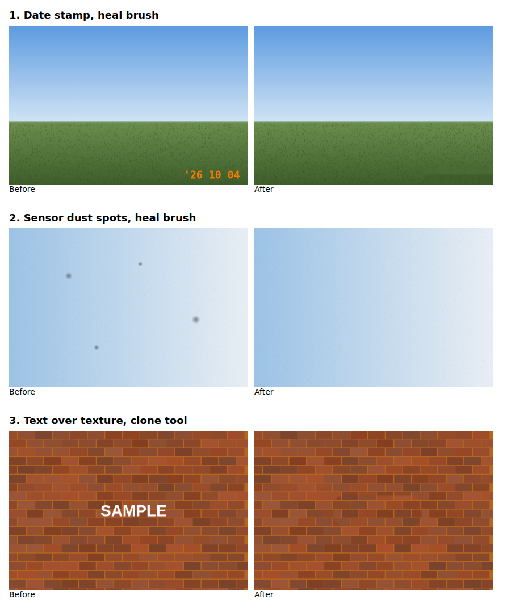

# Photo Retouch

A static, single-page photo retouch tool. Open `index.html` in a browser (or host it on GitHub Pages).

- **Heal brush**: paint over a date stamp, sensor spot or other mark and press *Remove*; the area is filled from its surroundings.
- **Clone**: Alt/Shift+click (or long press on touch) to pick a source, then paint to copy texture.
- Undo, revert, multiple images, JPEG download.

Images are processed locally in the browser and never uploaded. Intended for photos you own or have the rights to edit.

## Examples

